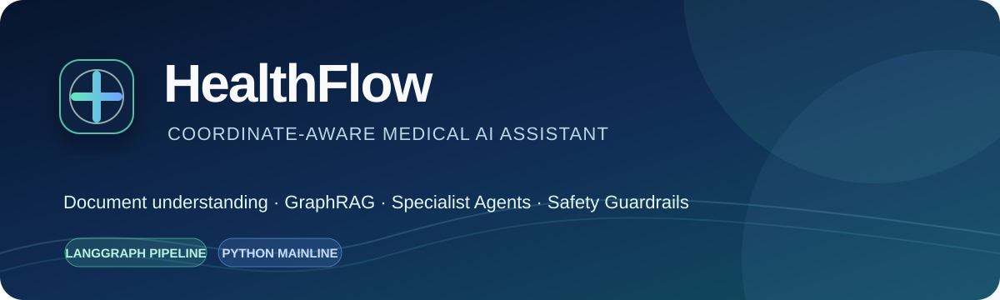
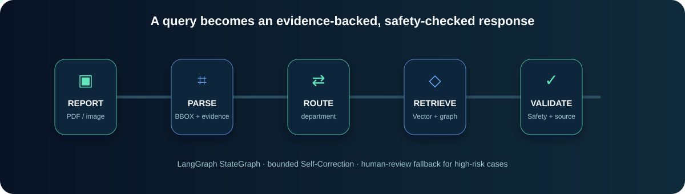
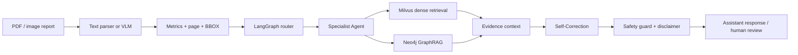

<p align="center">
  
</p>

<p align="center">
  <a href="README.md">简体中文</a> · <strong>English</strong> · <a href="README.ja.md">日本語</a> · <a href="README.ko.md">한국어</a>
</p>

# HealthFlow

HealthFlow is a multimodal medical-assistant prototype for health-check reports and medical documents. It connects document understanding, structured metrics, dynamic triage, evidence retrieval, specialist agents and safety validation into an auditable workflow.

<p align="center">
  
</p>

> Safety boundary: HealthFlow provides information organization and health-assistance suggestions only. It must not replace a physician, diagnose independently, prescribe, or provide specific medication dosage. High-risk cases should be escalated to a clinician or emergency service.

## Why HealthFlow

- Coordinate-aware parsing: keeps page numbers, normalized bounding boxes and source evidence together with extracted metrics.
- LangGraph orchestration: runs routing, retrieval, specialist generation and bounded self-correction as a typed state graph.
- Hybrid GraphRAG: fuses dense retrieval from Milvus with constrained medical paths and provenance from Neo4j.
- Safety-first response generation: combines deterministic rules, evidence references, uncertainty and human-review flags.
## Architecture



The main graph is implemented in [`app/agent/graph/medical_graph.py`](app/agent/graph/medical_graph.py) with four nodes:

```text
route → retrieve → generate → validate
```

The specialist implementations are regular Python services selected by the graph. They are not independent remote agents; this keeps the prototype deterministic, testable and easy to replace with a multi-agent runtime later.

## Reported offline metrics

The following numbers come from the project resume and interview handbook. The public repository does not include the original medical dataset, so these are historical/offline experiment claims rather than automatically reproducible benchmarks.

| Area | Reported result |
|---|---|
| Coordinate-aware multimodal parsing | 74% → 83% on a custom 500-report test set; +9 percentage points over a Qwen2.5-VL general baseline |
| DPO safety alignment | 2,400 preference pairs; high-risk hallucination 31% → 8% |
| Dynamic triage | 92% routing accuracy |
| GraphRAG | +18% recall over pure vector retrieval |
| Self-Correction | BERTScore > 0.82; multi-turn logic conflicts 24% → 6% |

These are not medical diagnosis accuracy or production SLA numbers. A reproducible release should also publish data provenance, split policy, Recall@K, confidence intervals and human-review protocol.

## Implemented capabilities

- Coordinate-aware PDF/image parsing with pixel coordinates, `[0, 0, 1000, 1000]` normalized coordinates, page numbers, evidence text and source IDs.
- Keyword-first triage with LLM fallback for ambiguous queries, department distributions, confidence, risk levels, low-confidence degradation and human-review flags.
- Endocrinology, cardiology, gastroenterology, respiratory and general-assistance specialist strategies with `[V-*]`/`[G-*]` evidence references.
- Weighted reciprocal-rank fusion of vector and graph retrieval results, preserving scores and graph paths.
- Bounded consistency checks for numeric conflicts, conclusion conflicts, conversation history and evidence coverage.
- Safety rules for dosage requests, direct diagnosis claims, single-metric conclusions, emergency symptoms and missing care escalation.
- SFT/QLoRA and DPO entry points, including migration from legacy `output/output_unsafe` fields to canonical `chosen/rejected` preferences.

## Quick start

The development profile uses SQLite by default. Model serving, Milvus and Neo4j are optional; without them, the API still starts and returns explicit degraded/fallback results.

```bash
python -m venv .venv
# Windows
.venv\Scripts\activate
pip install -e ".[dev]"
copy .env.example .env
uvicorn app.main:app --reload --port 8080
```

> Note: `[project]` only declares runtime dependencies. Heavy training/vector dependencies (torch, transformers, trl, vllm, ...) live in optional groups; install with `pip install -e ".[train]"` (vllm/bitsandbytes are CUDA-only on Linux — do not install on CPU-only machines).

Open:

- Web UI: http://localhost:5173 (see below)
- API docs: http://localhost:8080/docs
- Health check: http://localhost:8080/health
- Readiness check: http://localhost:8080/ready

### Frontend (optional)

The `frontend/` directory is a Vite + React single-page app. Its dev server proxies `/api` to `http://localhost:8080`:

```bash
cd frontend
npm install
npm run dev        # http://localhost:5173
npm run build      # outputs to frontend/dist
```

Pages: dashboard (backend status), report upload (PDF/image → parsed metrics), report list/detail (bbox/evidence), metric analysis (anomalies, trend chart, search), chat (SSE streaming with non-streaming fallback), knowledge graph (symptom → department).

For production persistence, set `APP_ENV=production` or `DATABASE_URL`. To enable graph/vector retrieval, configure Milvus and Neo4j and run:

```bash
python scripts/init_milvus.py
python scripts/init_neo4j.py
```

## Main API

| Method | Path | Purpose |
|---|---|---|
| POST | `/api/health/report/upload` | Upload and parse a PDF/image report |
| GET | `/api/health/report/{id}` | Read a report and coordinate-aware metrics |
| POST | `/api/health/chat` | Triage, retrieval, specialist response and safety validation |
| POST | `/api/health/chat/stream` | SSE response stream |
| POST | `/api/health/routing` | Run triage only |
| GET | `/api/health/safety/check` | Run an independent safety check |

## Project layout

```text
app/
├── agent/
│   ├── dynamic_router.py          # triage controller
│   ├── specialist_agents.py       # specialist strategies
│   ├── recursive_feedback.py      # Self-Correction
│   └── graph/medical_graph.py      # LangGraph StateGraph
├── service/
│   ├── vision_encoder.py          # PDF/image and BBOX parsing
│   ├── medical_rag.py              # hybrid retrieval and evidence context
│   ├── safety_guard.py             # model-external safety guard
│   ├── vlm_tuner.py                # coordinate-prefix SFT/QLoRA
│   └── safety_dpo.py               # preference validation and DPO
├── data/                           # SQLAlchemy, Milvus and Neo4j adapters
└── api/                            # FastAPI routes
```

## Data, safety and current limits

- No patient reports, real medical information or unverified datasets are published.
- All credentials must be injected through `.env`; never commit provider keys, database passwords or local reports.
- If a credential was ever committed, deleting the current file is not enough: revoke it and clean the Git history before opening the repository.
- Training requires GPU, PyTorch, Transformers, TRL and authorized data. The complete training, BERTScore and 500-report reproduction package is intentionally not included.
- This is a research and engineering demonstration project, not medical advice.
