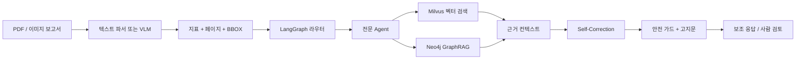

<p align="center">
  
</p>

<p align="center">
  <a href="README.md">简体中文</a> · <a href="README.en.md">English</a> · <a href="README.ja.md">日本語</a> · <strong>한국어</strong>
</p>

# HealthFlow

HealthFlow는 건강검진 보고서와 의료 문서를 위한 멀티모달 의료 보조 시스템 프로토타입입니다. 문서 이해, 검사 지표 구조화, 동적 진료과 라우팅, 근거 검색, 전문 Agent, 안전성 검증을 감사 가능한 하나의 워크플로로 연결합니다.

<p align="center">
  
</p>

> 안전 경계: HealthFlow는 정보 정리와 건강 보조 의견만 제공합니다. 의사의 진단, 처방 또는 구체적인 복용량 안내를 대신할 수 없습니다. 고위험 상황은 의료진에게 전달하거나 응급 의료기관을 이용해야 합니다.

## HealthFlow의 특징

- 좌표 인식 문서 분석: 추출된 지표와 페이지 번호, 정규화된 BBOX, 근거 텍스트를 함께 보존합니다.
- LangGraph 오케스트레이션: 라우팅, 검색, 전문 Agent 응답 생성, 제한된 Self-Correction을 타입이 있는 상태 그래프로 실행합니다.
- 하이브리드 GraphRAG: Milvus의 밀집 벡터 검색과 Neo4j의 제약된 의료 그래프 경로 및 출처 정보를 결합합니다.
- 안전 우선 응답 생성: 결정론적 규칙, 근거 인용, 불확실성, 사람 검토 플래그를 함께 사용합니다.
## 아키텍처



메인 그래프는 [`app/agent/graph/medical_graph.py`](app/agent/graph/medical_graph.py)에 구현되어 있으며 다음 4개 노드로 구성됩니다.

```text
route → retrieve → generate → validate
```

전문 Agent 구현은 그래프에서 선택되는 일반 Python 서비스입니다. 독립적인 원격 Agent가 아니므로 프로토타입의 동작을 결정론적으로 유지하고 테스트하기 쉽습니다. 향후 멀티 Agent 실행 환경으로 교체할 수 있습니다.

## 보고된 오프라인 지표

아래 수치는 프로젝트 이력서와 면접 자료에 기재된 실험 결과입니다. 공개 저장소에는 원본 의료 데이터셋이 포함되어 있지 않으므로 자동으로 재현되는 벤치마크로 간주해서는 안 됩니다.

| 영역 | 보고된 결과 |
|---|---|
| 좌표 인식 멀티모달 분석 | 자체 500건 보고서 테스트셋에서 74% → 83%, Qwen2.5-VL 일반 기준선 대비 9%p 향상 |
| DPO 안전 정렬 | 선호 쌍 2,400건, 고위험 환각률 31% → 8% |
| 동적 진료과 라우팅 | 라우팅 정확도 92% |
| GraphRAG | 순수 벡터 검색 대비 재현율 18% 향상 |
| Self-Correction | BERTScore > 0.82, 다중 턴 논리 충돌 24% → 6% |

이 수치는 의료 진단 정확도나 운영 SLA를 의미하지 않습니다. 재현 가능한 실험 패키지에는 데이터 출처, 분할 정책, Recall@K, 신뢰구간, 사람 검토 절차가 추가로 필요합니다.

## 구현된 주요 기능

- 페이지 픽셀 좌표, `[0, 0, 1000, 1000]` 정규화 좌표, 페이지 번호, 근거 텍스트, source ID를 포함하는 PDF/이미지 분석。
- 명시적 의료 키워드를 우선 처리하고 모호한 질문에는 LLM으로 대체하는 진료과 라우팅. 진료과 분포, 신뢰도, 위험 수준, 낮은 신뢰도 시 안전한 강등, 사람 검토 플래그를 제공합니다.
- 내분비내과, 심장내과, 소화기내과, 호흡기내과, 일반 지원 전략을 제공하며 `[V-*]`/`[G-*]` 근거 참조를 요구합니다.
- 벡터 검색과 그래프 검색 결과를 가중 Reciprocal Rank Fusion으로 통합하고 점수와 그래프 경로를 보존합니다.
- 수치 충돌, 결론 충돌, 대화 이력, 근거 커버리지를 확인하는 제한된 일관성 검증。
- 복용량 요청, 명시적 진단 단정, 단일 지표에 의한 결론, 응급 증상, 진료 안내 누락을 감지하는 안전 규칙。
- SFT/QLoRA 및 DPO 실행 진입점을 제공하며, 기존 `output/output_unsafe` 필드를 표준 `chosen/rejected` 선호 형식으로 변환할 수 있습니다.

## 빠른 시작

개발 환경은 기본적으로 SQLite를 사용합니다. 모델 서버, Milvus, Neo4j는 선택 사항이며, 설정하지 않아도 API는 실행되고 해당 기능은 명시적인 대체 결과를 반환합니다.

```bash
python -m venv .venv
# Windows
.venv\Scripts\activate
pip install -e ".[dev]"
copy .env.example .env
uvicorn app.main:app --reload --port 8080
```

접속 주소:

- 웹 프런트엔드: http://localhost:5173 (아래 참조)
- API 문서: http://localhost:8080/docs
- 상태 확인: http://localhost:8080/health
- 준비 상태 확인: http://localhost:8080/ready

### 프런트엔드(선택)

`frontend/`는 Vite + React 단일 페이지 앱입니다. 개발 서버는 `/api`를 `http://localhost:8080`으로 프록시합니다.

```bash
cd frontend
npm install
npm run dev        # http://localhost:5173
npm run build      # frontend/dist에 출력
```

페이지: 대시보드(백엔드 상태), 보고서 업로드, 보고서 목록/상세, 지표 분석(이상·추세·검색), 채팅(SSE 스트리밍), 지식 그래프(증상→진료과).

운영 데이터베이스를 사용하려면 `APP_ENV=production` 또는 `DATABASE_URL`을 설정합니다. 벡터 및 그래프 검색을 사용하려면 Milvus와 Neo4j를 구성한 뒤 다음 명령을 실행합니다.

```bash
python scripts/init_milvus.py
python scripts/init_neo4j.py
```

## 주요 API

| 메서드 | 경로 | 목적 |
|---|---|---|
| POST | `/api/health/report/upload` | PDF/이미지 보고서 업로드 및 분석 |
| GET | `/api/health/report/{id}` | 보고서와 좌표 기반 지표 조회 |
| POST | `/api/health/chat` | 라우팅, 검색, 전문 응답, 안전성 검증 |
| POST | `/api/health/chat/stream` | SSE 응답 스트림 |
| POST | `/api/health/routing` | 라우팅만 실행 |
| GET | `/api/health/safety/check` | 독립 안전성 검사 |

## 프로젝트 구조

```text
app/
├── agent/
│   ├── dynamic_router.py          # 진료과 라우팅
│   ├── specialist_agents.py       # 전문 전략
│   ├── recursive_feedback.py      # Self-Correction
│   └── graph/medical_graph.py      # LangGraph StateGraph
├── service/
│   ├── vision_encoder.py          # PDF/이미지 및 BBOX 분석
│   ├── medical_rag.py              # 하이브리드 검색과 근거 컨텍스트
│   ├── safety_guard.py             # 모델 외부 안전 가드
│   ├── vlm_tuner.py                # 좌표 접두사 SFT/QLoRA
│   └── safety_dpo.py               # 선호 검증과 DPO
├── data/                           # SQLAlchemy, Milvus, Neo4j 어댑터
└── api/                            # FastAPI 라우트
```

## 데이터, 보안 및 현재 제한

- 환자 보고서, 실제 의료 정보, 라이선스가 확인되지 않은 데이터셋을 공개하지 않습니다.
- 모든 인증 정보는 `.env`로 주입해야 하며, 공급자 키, 데이터베이스 비밀번호, 로컬 보고서를 Git에 커밋하지 마십시오.
- 인증 정보가 과거에 커밋된 적이 있다면 현재 파일만 삭제해서는 충분하지 않습니다. 키를 폐기하고 공개 전에 Git 기록도 정리해야 합니다.
- 학습에는 GPU, PyTorch, Transformers, TRL 및 승인된 데이터가 필요합니다. 전체 학습·BERTScore·500건 보고서 재현 패키지는 포함하지 않습니다.
- 이 프로젝트는 연구 및 엔지니어링 데모이며 의료 조언이 아닙니다.
